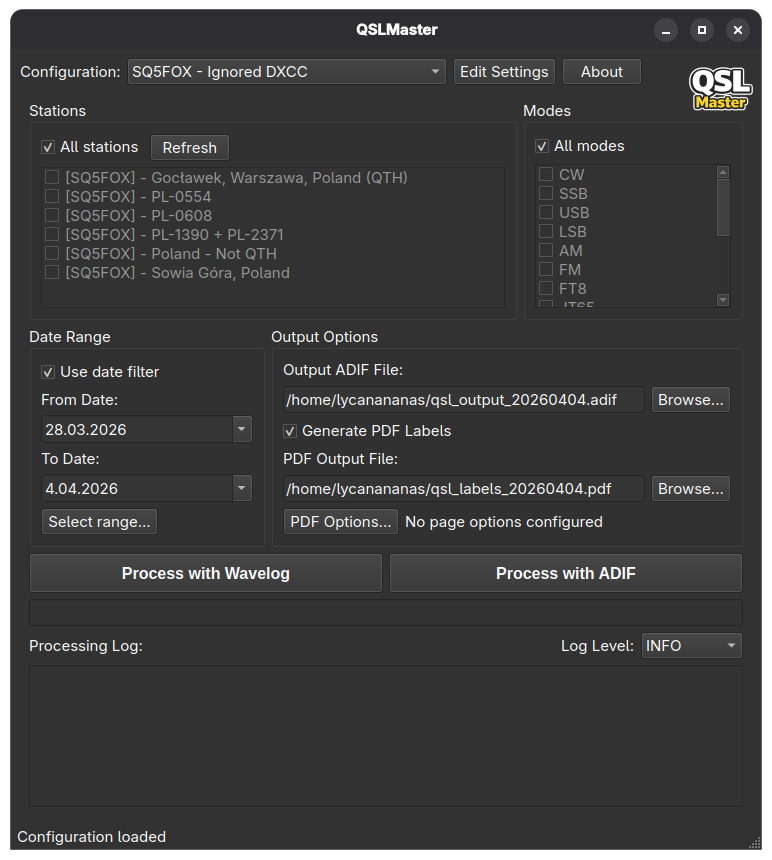
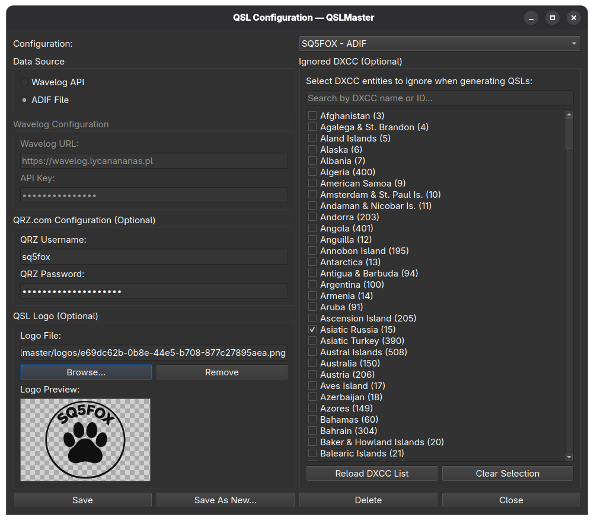
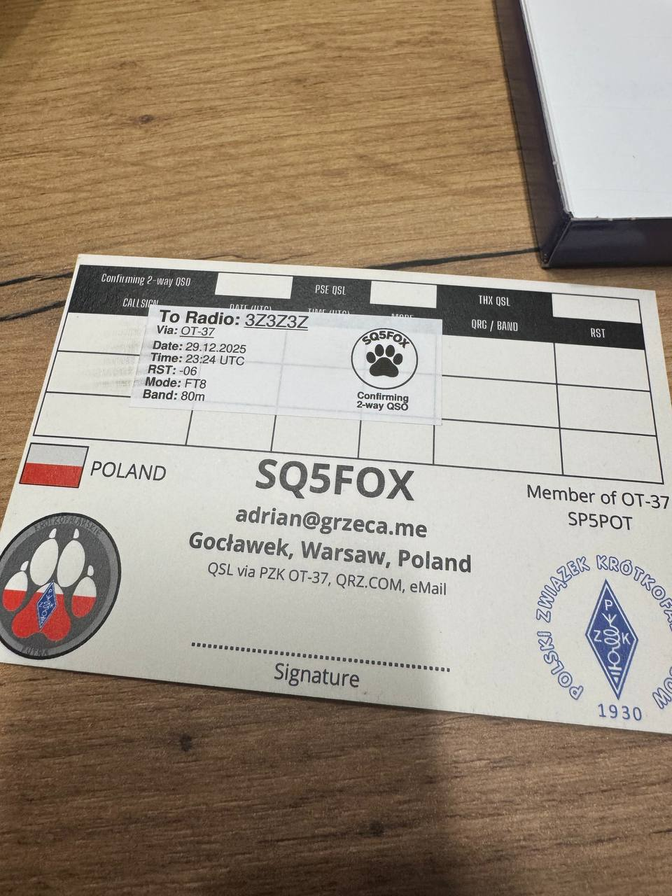
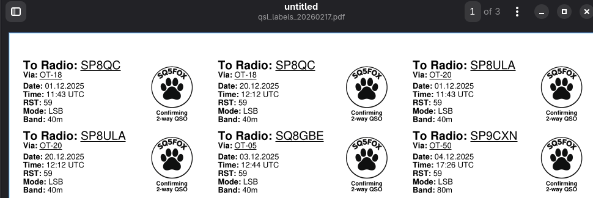

# QSLMaster


Download QSO data from Wavelog or a local ADIF file and prepare ADIF output and printable QSL labels. The project includes both a CLI and a GUI, sharing the same processing core.

## Features

- CLI and GUI based workflows
- ADIF loading/parsing from Wavelog API or local file
- Date range filtering
- QSL bureau verification via QRZ.com (optional)
- Country specific processing for Poland (PZK lookup)
- PDF label generation (Avery 70x25.4mm A4, 33 labels per sheet)
- Background processing and live progress in GUI

## Requirements

- Python 3.7+
- Wavelog 2.0.0 or higher (only when using `source: wavelog`)
- CLI dependencies in requirements.txt
- GUI dependencies in requirements-gui.txt

Tested only on Linux. Other platforms are currently untested.

## Installation

1. Clone the repository:
```bash
git clone https://github.com/lycanananas/QSLMaster.git
cd QSLMaster
```

2. Create virtual environment:
```bash
python3 -m venv venv
```

3. Activate virtual environment:
```bash
# On Linux/macOS:
source venv/bin/activate

# On Windows:
venv\Scripts\activate
```

4. Install CLI dependencies:
```bash
pip install -r requirements.txt
```

5. Install GUI dependencies (optional):
```bash
pip install -r requirements-gui.txt
```

## Install from Releases

Prebuilt packages and binaries are available on GitHub Releases:

https://github.com/lycanananas/QSLMaster/releases

- Ubuntu (`.deb`):
```bash
sudo apt install ./qslmaster_<VERSION>-1_<ubuntu-codename>_amd64.deb
```

- Arch Linux (`.pkg.tar.zst`):
```bash
sudo pacman -U ./qslmaster-<VERSION>-1-x86_64.pkg.tar.zst
```

- Windows:
  - Installer artifact: `*_installer` (`...-setup.exe`)
  - Portable binaries artifact: `*_no_installer` (`.zip`)

## Configuration

### CLI configuration file

1. Copy config.example.json to config.json:
```bash
cp config.example.json config.json
```

2. Edit config.json and fill in:
  - `source` - Data source: `wavelog` or `adif_file`
  - `api_key` - Your API key from Wavelog (required for `source: wavelog`)
  - `wavelog_url` - URL of your Wavelog instance (required for `source: wavelog`)
  - `adif_file_path` - Path to input ADIF file (optional in config; required at runtime for `source: adif_file` unless provided with `--adif-source`)
  - `qrz_username` - Your QRZ.com username (optional)
  - `qrz_password` - Your QRZ.com password (optional)
  - `ignored_dxcc` - List of DXCC IDs to skip during QSL generation (optional)

Example config.json:
```json
{
  "source": "wavelog",
  "api_key": "your_api_key_here",
  "wavelog_url": "https://wavelog.example.com",
  "adif_file_path": "/path/to/input.adi",
  "qrz_username": "your_qrz_username",
  "qrz_password": "your_qrz_password",
  "ignored_dxcc": [15, 54]
}
```

DXCC IDs `15` and `54` correspond to Asiatic Russia and European Russia.

QRZ.com credentials are optional. If not provided, bureau verification for non-Poland stations is skipped.

### GUI configuration and credentials

The GUI stores configuration in the user profile and keeps secrets in the system keyring.

For `source: adif_file` in GUI, selecting an ADIF file in configuration is optional. The file is selected when clicking `Generate QSLs (ADIF)`.

Config file locations:
- Linux: `~/.config/qslmaster/config.json`
- macOS: `~/Library/Application Support/qslmaster/config.json`
- Windows: `%APPDATA%\QSLMaster\config.json`

Keyring backends:
- Linux: `libsecret (GNOME Keyring) or KWallet`
- macOS: `Keychain`
- Windows: `Credential Manager`

## Usage

### GUI

Launch the GUI:
```bash
python qslmaster_gui/main.py
```

### CLI

Download all contacts:
```bash
python qslmaster_cli/main.py --config config.json -o output.adif
```

Use local ADIF file source:
```bash
python qslmaster_cli/main.py --config config.json --source adif_file --adif-source ./input.adi -o output.adif
```

List stations (Wavelog source only):
```bash
python qslmaster_cli/main.py --config config.json --source wavelog --list-stations-only
```

Filter by date range:
```bash
python qslmaster_cli/main.py --config config.json --from-date 2024-01-01 --to-date 2024-12-31 -o output.adif
```

Generate PDF labels:
```bash
python qslmaster_cli/main.py --config config.json -o output.adif --generate-pdf labels.pdf
```

Help:
```bash
python qslmaster_cli/main.py --help
```

## Photos

### Application Interface





### QSL Card Example



### Generated PDF Labels



## Validating ADIF Output

After generating the ADIF file, validate its integrity:
```bash
python qslmaster_cli/validate_adif.py qsl.adi
```

## Testing

Unit tests for callsign extraction:
```bash
python -m qslmaster_cli.callsign_selftest
```

QRZ bureau verification self-test (requires `qrz_username`/`qrz_password` in `config.json`):
```bash
python -m qslmaster_cli.qrz_selftest --config config.json
```

QRZ bureau verification with additional random callsigns (default 10 when `--random` has no value):
```bash
python -m qslmaster_cli.qrz_selftest --config config.json --random
python -m qslmaster_cli.qrz_selftest --config config.json --random 35
```

PZK bureau lookup self-test:
```bash
python -m qslmaster_cli.pzk_selftest
```

Ignored DXCC filter self-test:
```bash
python -m qslmaster_cli.ignored_dxcc_selftest
```

This runs basic tests for the `extract_homecall()` function which handles various callsign formats including slashed callsigns (e.g., `DL/SQ5FOX/M/DL` → `SQ5FOX`).

## Building

### Build CLI Package

```bash
python -m pip install --upgrade pip
pip install -r requirements-gui.txt
pip install pyinstaller pillow

# Optional (for icon generation used below)
python packaging/windows/build_icon.py

# Windows PowerShell/CMD variant (use ; in --add-data)
pyinstaller --noconfirm --clean --onefile --icon qslmaster.ico --paths . --collect-submodules qslmaster_gui --collect-submodules qslmaster_cli --collect-data pyhamtools --add-data "qslmaster_gui/resources/icon.png;." --add-data "qslmaster.ico;." --name qslmaster-cli packaging/windows/entry_cli.py
```

### Build Arch Linux Package

Requires `makepkg`:
```bash
VERSION=$(python -c "from qslmaster_version import SOURCE_VERSION; print(SOURCE_VERSION)")
sed "s/__VERSION__/${VERSION}/g" arch/PKGBUILD.release > PKGBUILD.release
makepkg -p PKGBUILD.release -si
```

### Build GUI Standalone (PyInstaller)

```bash
python -m pip install --upgrade pip
pip install -r requirements-gui.txt
pip install pyinstaller pillow

# Optional (for icon generation used below)
python packaging/windows/build_icon.py

# Windows PowerShell/CMD variant (use ; in --add-data)
pyinstaller --noconfirm --clean --onefile --windowed --icon qslmaster.ico --paths . --collect-submodules qslmaster_gui --collect-submodules qslmaster_cli --collect-data pyhamtools --add-data "qslmaster_gui/resources/icon.png;." --add-data "qslmaster.ico;." --name qslmaster packaging/windows/entry_gui.py
```

The executable will be in `dist/` directory.

## Troubleshooting

Keyring not available:
- Ubuntu/Debian GNOME: `sudo apt-get install gnome-keyring dbus-user-session`
- Ubuntu/Debian KDE: `sudo apt-get install kwalletmanager`
- Arch Linux (GNOME): `sudo pacman -S gnome-keyring libsecret`
- Arch Linux (KDE): `sudo pacman -S kwalletmanager`

Cache issues:
```bash
rm -rf ~/.cache/qslmaster/
```

## API Documentation

- Wavelog API: https://github.com/wavelog/wavelog/wiki/API
- QRZ.com XML API: https://www.qrz.com/page/api


## License

QSLMaster is distributed under the GNU General Public License v3.0. For details, see LICENSE.md or https://www.gnu.org/licenses/gpl-3.0.en.html

## Contributing

Contributions are welcome. Please open issues or pull requests.
